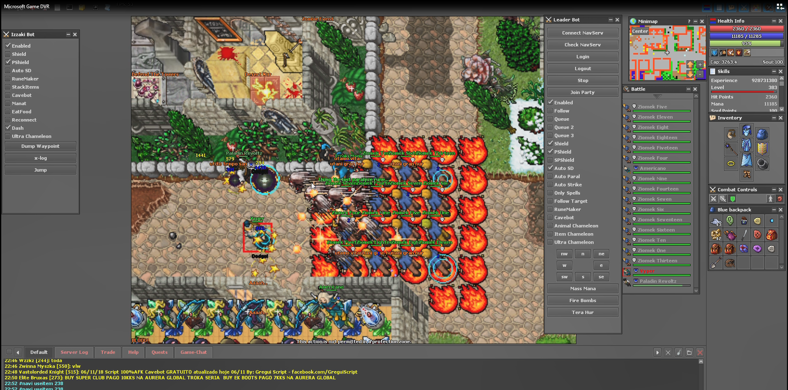

# navigation-server

Navigation server written in NodeJS to propagate Leader's commands to bot members.
Just like a botnet.

Project uses sockets to comunicate. The packets are based on Otclient/Otserver that are based on Tibia game.

I recently use it playing Tibia via Otclient. (Maybe it could be used for other games too?)

It allows me to play multiple players simultaneously just like on the screen.
Of course bot implementation is another piece of cake.

